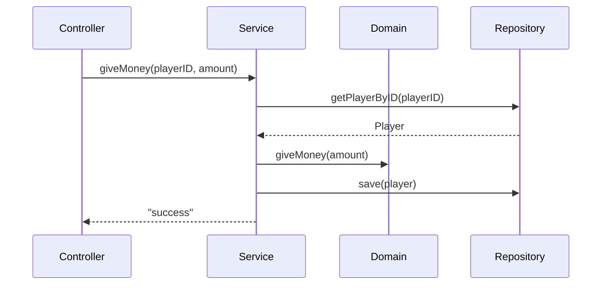

# Architecture

Layer structure :
- domain : Domain models with core business logic, independent on bukkit
- service : Application layer orchestrating domain models around use-cases. Make the links between layers and bukkit
- repository : persistence layer
- controller : User interface layer. Menus, commands and event handlers. Should be thin, delegates logic to the application layer

```
.
├── config
├── controller
│   ├── command
│   ├── menu
│   └── event
├── domain
│   ├── guild
│   ├── player
│   └── ...
├── repository
│   └── hibernate
└── service
    ├── guild
    ├── player
    └── domain
```

